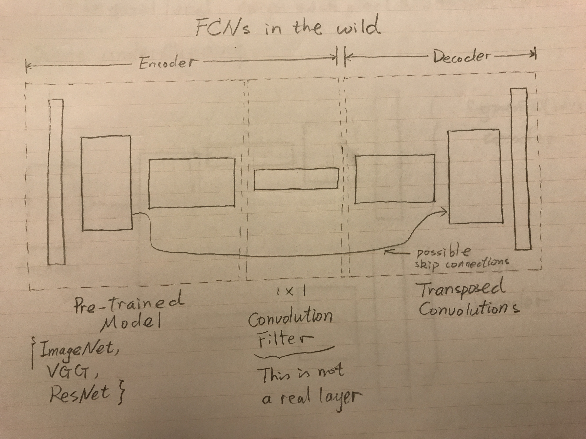
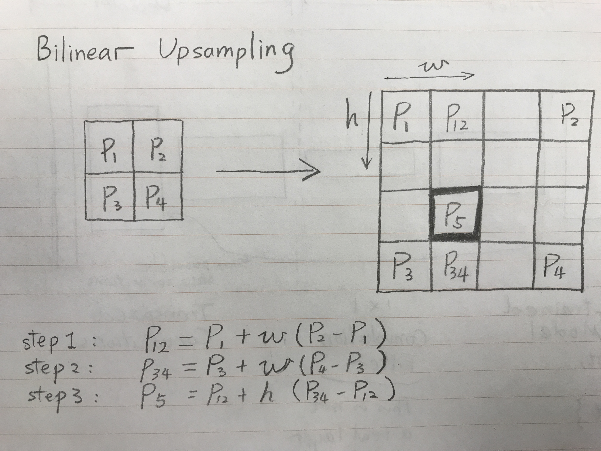
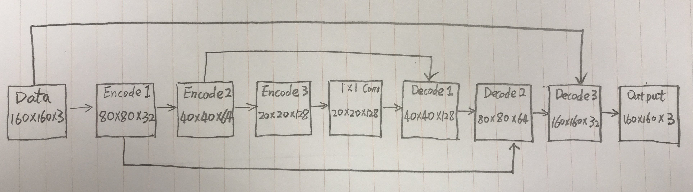

```{r setup, include=FALSE}
knitr::opts_chunk$set(echo = TRUE)
```

## 0. Introduction

In this project, I used fully convolutional networks (FCNs) to do semantic 
segmentations on images containing a human target. I will first talk about what 
FCNs are, and why they are useful. Then, the specific techniques used in the 
semamtic segmentation will be dicussed. After this, I will show how I 
implemented the FCN in Keras, and the result by running the model on AWS. 
At the end, there are discussions and future enhancement suggestions.

## 1. Fully Convolutional Networks

FCNs have an autoencoder 
architecture that consists of encoders and decoders. In general, the input 
images and the output images of a FCN have exactly the same dimension. 
What a FCN does is to perform pixel-wise classification, where it tries to 
assign each pixel in the input image a label, and shows this label information 
in the output image by a specific color, as shown in the following figure (The 
image on the left is the input image with the target person in it, and the 
image in the middle is the ground truth for supervised learning, and the image 
on the right is the output of a FCN with the target being painted blue).


Traditional CNNs usually have several 
fully connected layers at the end of the architecture, which will average out 
any spatial information contained in the last pooling layer. This feature 
limits their capability when dealing with tasks like semantic segmentation that
requires to preserve the spatial information. However, instead of fully 
connected layers, FCNs used 1x1 convolutional layers after the last upsamling 
layer to preserve the required spatial information.
A 1x1 convolutional layer is really just a convolutional layer with kernel 
size 1 and stride 1, and at each pixel, the input channels and output channels 
are fully connected. This design preserves spatical information by not 
averaging different input pixels, and also learns through adusting those 
weights between input and output channels.

As being said before, a FCN has an encoder/decoder architecture. In the encoder layers, 
spatial information is downsampled by convolving the data with certain kernels, 
and in the decoder layers (usually, [transposed convolutional layers](https://arxiv.org/pdf/1603.07285.pdf)), 
this information is recovered through upsampling. Howver, a problem of the 
encoder/decoder design is that 
during the downsampling process in the encoder layers, resolutions are 
decreased and spatial information is lost. This lost information 
is very important for detecting the spatial boundaries between different 
objects, but it will never be regained during upsampling in the decoder layers. 
Thus, FCNs adopt a technique called skip-connection that allows a certain decoder 
layer to have access to a certain encoder layer that stores this high-resolution 
spatial information, and incorperate (in some ways) this information/data with 
the data of the current decoder layer. This method will increase the network's 
ability to recognize different objects in an image. 

Conceptually, a typical FCN architecture is shown in the following figure (a 
detailed network used in practice will be shown later):



**Note: the 1x1 convolution filter in the middle is really just a filter, and ** 
**it is not a real layer.**

## 2. Semantic Segmentation

For the current semantic segmentation project, I used the FCNs to do object 
detection and classification, but took different approaches regarding the three 
features discussed above. Specifically,

**1) Convolution layers: separable convolution**

A separable convoluton layer has two parts. The first part is to apply a 
different kernel with depth 1 to each channel of the input layer. In 
this step, the width and height of the input layer could change depending on 
the padding and stride size, but the depth of the input layer does not change. 
After this, perform a normal convolution on the output of the first step with a 
kernel of size 1 and depth k (1x1 convolution). The stride should be of size 1. In this 
step, the width and height do not change, but the depth will change from 
whatever the input depth is to depth k. This implentation greatly reduces the 
dimension of the model, and make it much easier for training. A good slide 
demonstration of the separable convolution can be found [here](https://www.slideshare.net/DongWonShin4/depthwise-separable-convolution).

**2) Upsampling: bilinear upsampling**

An illustration of the bilinear upsampling is shown in the following figure. 
Briefly speaking, to upsample a 2x2 matrix to a 4x4 matrix, one needs to put 
the four numbers in the 2x2 matrix at the 4 corners of the 4x4 matrix, and then 
to perform linear interpolation as shown in the figure.



**3) Skip connections: layer concatenation**

One way to do skip connections is to concatenate an upsampled layer with the 
corresponding layer in the encoder that has the same width and height dimension.
One of the advantages of this implementation is that the two 
concatenated layers do not need to have the same depth, which allows some 
flexibility. 

## 3. Implementation for the Follow Me Project

#### A) Helper functions

Several helper functions are defined for later use.
```
def separable_conv2d_batchnorm(input_layer, filters, strides=1):
    output_layer = SeparableConv2DKeras(filters=filters,kernel_size=5, strides=strides,
                             padding='same', activation='relu')(input_layer)
    
    output_layer = layers.BatchNormalization()(output_layer) 
    return output_layer
    

def conv2d_batchnorm(input_layer, filters, kernel_size=5, strides=1):
    output_layer = layers.Conv2D(filters=filters, kernel_size=kernel_size, strides=strides, 
                      padding='same', activation='relu')(input_layer)
    
    output_layer = layers.BatchNormalization()(output_layer) 
    return output_layer
    
    
def bilinear_upsample(input_layer):
    output_layer = BilinearUpSampling2D((2,2))(input_layer)
    return output_layer
```
The function `separable_conv2d_batchnorm` is used in both encoder and decoder 
layers, the function `conv2d_batchnorm` is used for the 1x1 convolutional layer, 
and the function `bilinear_upsample` is used in the decoder layer.

#### B) Encoder layer

The code for each encoder layer is as follows:
```
def encoder_block(input_layer, filters, strides):
    output_layer = separable_conv2d_batchnorm(input_layer, filters, strides=strides)
    
    return output_layer
```
As discussed above, I used separable convolution for each encoder layer, and 
the filter depth `filters` increases for deeper layers. I used stride size of 2 
for each layer to downsample the data.

#### C) Decoder layer

The code for each decoder layer is as follows:

```
def decoder_block(small_ip_layer, large_ip_layer, filters):
    
    # Upsample the small input layer using the bilinear_upsample() function.
    output_layer = bilinear_upsample(small_ip_layer)
    
    if large_ip_layer != None:
        # Concatenate the upsampled and large input layers using layers.concatenate
        output_layer = layers.concatenate([large_ip_layer, output_layer])

    # Add some number of separable convolution layers
    output_layer = separable_conv2d_batchnorm(output_layer, filters, strides=1)
    
    return output_layer
```
For each decoder layer, I used function `bilinear_upsample` to increase the 
dimensions by a factor of 2. For some decoder layers (not all of them), I 
combined them with corresponding layers in the encoder to get more informaton 
about the input data.

#### D) FCN model

The full model is shown in the following figure:


The code for the full model is:
```
def fcn_model(inputs, num_classes):
    
    # filter depth
    fd = 32
    
    ###############
    ### 2-layer ###
    ###############
#     # Add Encoder Blocks. 
#     # Remember that with each encoder layer, the depth of your model (the number of filters) increases.
#     en_layer1 = encoder_block(inputs, fd, 2)
#     # Now 80x80xfd
#     en_layer2 = encoder_block(en_layer1, fd*2, 2)
#     # Now 40x40xfd*2
    
#     # Add 1x1 Convolution layer using conv2d_batchnorm().
#     en_1by1 = conv2d_batchnorm(en_layer2, fd*4, kernel_size=1, strides=1)
#     # Now 40x40xfd*4
    
#     # Add the same number of Decoder Blocks as the number of Encoder Blocks
#     de_layer1 = decoder_block(en_1by1, en_layer1, fd*2)
#     # Now 80x80xfd*2
#     de_layer2 = decoder_block(de_layer1, inputs, fd)
#     # Now 160x160xfd
    
#     x = de_layer2
    
    
    ###############
    ### 3-layer ###
    ###############
    # Add Encoder Blocks. 
    # Remember that with each encoder layer, the depth of your model (the number of filters) increases.
    en_layer1 = encoder_block(inputs, fd, 2)
    # Now 80x80xfd
    en_layer2 = encoder_block(en_layer1, fd*2, 2)
    # Now 40x40xfd*2
    en_layer3 = encoder_block(en_layer2, fd*4, 2)
    # Now 20x20xfd*4
    
    # Add 1x1 Convolution layer using conv2d_batchnorm().
    en_1by1 = conv2d_batchnorm(en_layer3, fd*4, kernel_size=1, strides=1)
    # Now 20x20xfd*4
    
    # Add the same number of Decoder Blocks as the number of Encoder Blocks
    de_layer1 = decoder_block(en_1by1, en_layer2, fd*4)
    # Now 40x40xfd*4
    de_layer2 = decoder_block(de_layer1, en_layer1, fd*2)
    # Now 80x80xfd*2
    de_layer3 = decoder_block(de_layer2, inputs, fd)
    # Now 160x160xfd
    
    x = de_layer3
    
    # The function returns the output layer of your model. "x" is the final layer obtained from the last decoder_block()
    return layers.Conv2D(filters=num_classes, kernel_size=1, strides=1, activation='softmax', padding='same')(x)
```

#### E) Training

**Data**

* **For training: 4131 samples**

* **For validation: 1184 samples**

**kernel size**

I tried kernel size 3 and kernel size 5, and so far kernel size 3 works better 
for me.

**number of layers**

I used 3 encoder layers and 3 decoder layers. I tried to use just 2 encoder 
layers and 2 decoder layers, and the result was not very good. Using more than 4 
layers might give better results, and but that would be hard to train.

**learning_rate**

This is one of the most important hyper parameters in machine learning, not just 
deep learning. A large learning rate makes the algorithm converge faster, but it 
also brings the danger of overshoot. A very small learning rate will make the 
process too slow. The choice of learning rate should also be combined with the 
choice of the batch size in SGD: larger batch size should be paired with larger 
learning rate, and smaller batch size should be paired with smaller learning 
rate. After several experimentations, I found 0.001 worked very well for me.

**batch_size**

I experimented with different batch sizes, such as 30, 40, and 100, and I found 
that a relatively small batch size like 30 and 40 gives me better results. 
However, I found some [articles](https://research.fb.com/publications/accurate-large-minibatch-sgd-training-imagenet-in-1-hour/) 
that advertised larger batch size. I think batch size might be as important as 
the learning rate in SGD, since it kind of defines the changes of the 
landscape of the cost function. A smaller batch size could make the landscape 
vary dramatically from batch to batch, which might be good to get out of local 
minima. A larger batch size would bring more stability to the fitting 
procedure, but the algorithm might get caught by a sharp local minimum. It is 
highly possible that whether a large batch size is better or not really depends 
on the data and the model. I need more experience to give a better judgement.

**num_epochs**

I just experimented with different number of epochs. This parameter matters in 
a way that one should choose a value just before the overfitting (if there is 
one) begins to appear.

**steps_per_epoch**

There are roughly 4000 training samples, and thus I chose 4000/40 = 100 steps. 

**validation_steps**

There are roughly 1200 validation samples, and thus I chose 1200/40 = 30 steps.

**workers**

I did not see much difference when selecting different numbers of workers, and 
so I just chose a relatively large number so that if there are more workers 
available, I could use them all.

I have tried several architectures and many combinations of parameters, but 
most of them did not give me good final scores (definition is described in the 
next section). For example, in the beginning, I used a 2-encoder/2-decoder 
model, and the best result I obtained for this simpler model was 0.3896 
with kernel size 5, batch size 40, kernel depth 32, learning rate 0.001 and 
epoch number 100. Without getting good results with a smaller model, I switched 
to a 3-encoder/3-decoder model which is the one shown in the figure in the 
section 3D. I tried several combinations of hyperparameters, and here I just 
list a few of them:

##### Example trial 1:


##### Example trial 2:


##### Example trial 3:


The trial 3 is the one I am submitting.


#### F) Evaluation of the final model

To evaluate the model, three data sets are used:

* dataset 1: the quad is following the target (542 samples in total)

* dataset 2: the target is not available (270 samples in total)

* dataset 3: the target is far away (322 samples in total)

For each dataset, the following values are obtained: 

* **iou**: average intersection over union for the target

* **true_pos**: number of true positives

* **false_pos**: number of false positives

* **false_neg**: number of false negatives

The results (trial 3) are:

* dataset 1: iou1 = 0.9189, true_pos1 = 539, false_pos1 = 0, false_neg1 = 0

* dataset 2: iou2 = 0, true_pos2 = 0, false_pos2 = 35, false_neg2 = 0

* dataset 3: iou3 = 0.1985, true_pos3 = 109, false_pos3 = 1, false_neg3 = 192

First, the weight is calculated as

```
true_pos = true_pos1 + true_pos2 + true_pos3
false_pos = false_pos1 + false_pos2 + false_pos3
false_neg = false_neg1 + false_neg2 + false_neg3

weight = true_pos/(true_pos+false_neg+false_pos)
```
which gives number 0.7148.

Then, the final iou for the target is
```
final_IoU = (iou1 + iou3)/2
```
which is 0.5587.

At last, the final score is
```
final_score = final_IoU * weight
```
which is **0.4132**.


## 4. Discussions

The current model was trained on a specific set of human data, 
and thus, I will be very surprised if the model can do very well on detecting 
other objects such as cats, dogs or cars. To have a model that can detect a 
specific object, the basic requirement is that one must train the model on data 
where that specific object exists and is labeled. 

I tried a 2-encoder/2-decoder model, and in general it could not give me any 
result better than 0.39, but some students on the slack channel claimed that 
they could achieve required accuracy (0.4). Thus, maybe I should try more 
combinations of hyperparameter. A 3-encoder/3-decoder model does not necessarily 
work better than a 2-encoder/2-decoder model depending on their parameter 
choices, but the only meet-requirement score I obtained came from a 3-encoder/3-decoder 
model, which is shown above. 

## 5. Future Enhancement

To improve a model's performance, the first thing is always to get better data, 
and better data means that it should better represent all kinds of situations a 
robot could face during operations. Thus, the first thing I will do is to gather 
data in different situations, especially data images where the target is far 
away in the scene. This is because I could get very good iou scores when the 
target is near (following mode), which are usually above 0.85. However, the 
iou scores when the target is far away in the scene are very low, and are 
usually stuck around 0.1 or 0.2. If I could get more data when the target is far 
away, the final performance of the model might be greatly enhanced.

During the training, I found that overfitting is a serious issue here. I tried 
to train the network for 200 epochs, and obtained an extremely low training 
loss, but the validation score remained high. Thus, any regularization should 
make the model work better, and the second thing I will try is to add dropout 
to certain layers. I need to experiment a bit to know which layers should be 
regularized.

I used a stride of 2 in the encoder layers to downsample the data, and I am not 
clear how pooling layers will work here. Thus, I may try to use pooling layers 
to downsample the data, and see whether that will improve the performance. 

There are many good advices from experts in deep learning, but based on my 
experience of deep learning so far (all from Udacity's course), 
it is essentially a trial and error game. Thus, reading more and trying more 
myself is the best thing I can do to improve the model on a specific data 
set and to improve the understanding of the whole field. 


